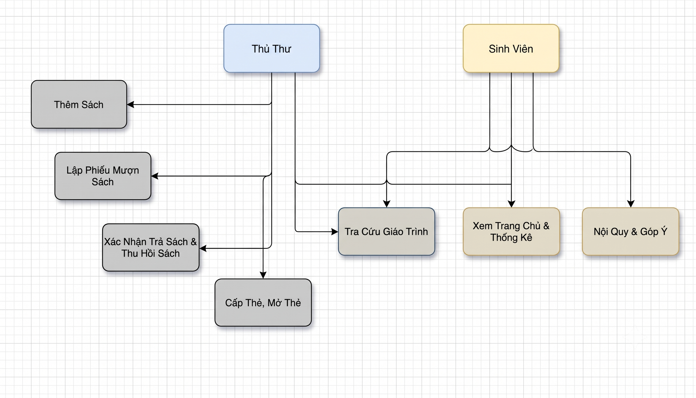
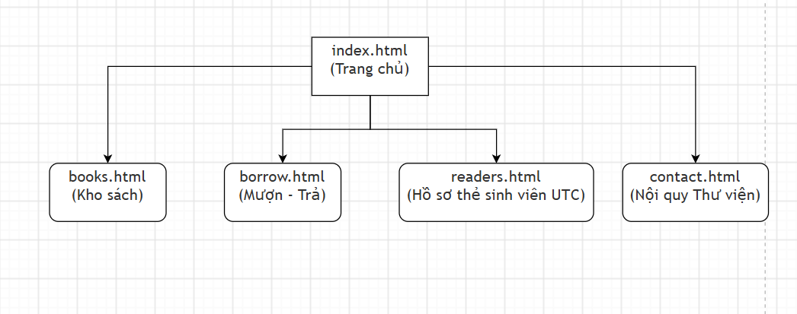

# BÁO CÁO BÀI TẬP LỚN MÔN THIẾT KẾ WEB

## ĐỀ TÀI: XÂY DỰNG WEBSITE HỆ THỐNG THƯ VIỆN ĐIỆN TỬ UTC

### CHUYÊN NGÀNH CÔNG NGHỆ THÔNG TIN

---

**TRƯỜNG:** ĐẠI HỌC GIAO THÔNG VẬN TẢI (UTC)  
**KHOA:** CÔNG NGHỆ THÔNG TIN  
**LỚP:** CÔNG NGHỆ THÔNG TIN 3  
**HỌC PHẦN:** THIẾT KẾ WEB  
**HỌC KỲ / NĂM HỌC:** HỌC KỲ I - NĂM 2  
**ĐỀ TÀI SỐ:** 01 - QUẢN LÝ THƯ VIỆN  
**CÔNG NGHỆ ÁP DỤNG:** HTML5, CSS3, JavaScript Cơ Bản, Bootstrap 5

### BẢNG PHÂN CÔNG THÀNH VIÊN TRONG NHÓM (NHÓM 5 THÀNH VIÊN - UTC)

| STT | Họ và tên sinh viên                    | Mã sinh viên  | Email                           | Trang phụ trách                | Nhiệm vụ chính trong dự án |
| :-: | :------------------------------------- | :-----------: | :------------------------------ | :----------------------------- | :------------------------- |
|  1  | **Trương Mạnh Đạt**<br>_(Nhóm trưởng)_ | **251230841** | `dat251230841@lms.utc.edu.vn`   | `index.html`<br>(Trang chủ)    | .                          |
|  2  | **Nguyễn Phương Hải**                  | **251210853** | `hai251210853@lms.utc.edu.vn`   | `books.html`<br>(Kho sách)     | .                          |
|  3  | **Nguyễn Quốc Khánh**                  | **251230003** | `khanh251230003@lms.utc.edu.vn` | `borrow.html`<br>(Mượn - Trả)  | .                          |
|  4  | **Trần Xuân Đô**                       | **251230004** | `do251230004@lms.utc.edu.vn`    | `readers.html`<br>(Độc giả)    | .                          |
|  5  | **Đinh Văn Phan Dũng**                 | **251230826** | `dung251230005@lms.utc.edu.vn`  | `contact.html`<br>(Nội quy)    | .                          |

---

# MỤC LỤC BÁO CÁO

- [I. ĐỀ TÀI](#i-đề-tài)
  - [1. Sơ lược về hệ thống](#1-sơ-lược-về-hệ-thống)
  - [2. Nghiệp vụ của hệ thống (Giới thiệu bài toán)](#2-nghiệp-vụ-của-hệ-thống-giới-thiệu-bài-toán)
  - [3. Mục đích và yêu cầu](#3-mục-đích-và-yêu-cầu)
- [II. KHẢO SÁT & PHÂN TÍCH](#ii-khảo-sát--phân-tích)
  - [1. Tìm hiểu các website đã có cùng chủ đề](#1-tìm-hiểu-các-website-đã-có-cùng-chủ-đề)
  - [2. Trình bày các đối tượng sử dụng](#2-trình-bày-các-đối-tượng-sử-dụng)
  - [3. Trình bày các chức năng cơ bản cho từng đối tượng](#3-trình-bày-các-chức-năng-cơ-bản-cho-từng-đối-tượng)
- [III. THIẾT KẾ HỆ THỐNG](#iii-thiết-kế-hệ-thống)
  - [1. Sơ đồ Use-Case (Use-case Diagram)](#1-sơ-đồ-use-case-use-case-diagram)
  - [2. Sơ đồ cấu trúc trang (Sitemap)](#2-sơ-đồ-cấu-trúc-trang-sitemap)
  - [3. Thiết kế Wireframe bố cục các trang](#3-thiết-kế-wireframe-bố-cục-các-trang)
- [IV. TRIỂN KHAI XÂY DỰNG WEBSITE](#iv-triển-khai-xây-dựng-website)
  - [1. Cấu trúc thư mục dự án](#1-cấu-trúc-thư-mục-dự-án)
  - [2. Giải thích giao diện và phương pháp hiện thực (HTML, CSS, JS)](#2-giải-thích-giao-diện-và-phương-pháp-hiện-thực-html-css-js)
- [V. KIỂM THỬ HỆ THỐNG (TESTING)](#v-kiểm-thử-hệ-thống-testing)
  - [1. Mục tiêu kiểm thử](#1-mục-tiêu-kiểm-thử)
  - [2. Xây dựng các Test Cases (Link, Effect, Data Validation)](#2-xây-dựng-các-test-cases-link-effect-data-validation)
- [VI. TỰ ĐÁNH GIÁ & KẾT LUẬN](#vi-tự-đánh-giá--kết-luận)
  - [1. Đánh giá nhóm](#1-đánh-giá-nhóm)
  - [2. Bảng điểm tự đánh giá cá nhân](#2-bảng-điểm-tự-đánh-giá-cá-nhân)
  - [3. Bảng điểm nhóm đánh giá từng cá nhân](#3-bảng-điểm-nhóm-đánh-giá-từng-cá-nhân)

---

# I. ĐỀ TÀI

### 1. Sơ lược về hệ thống

Hệ thống **"Thư Viện Điện Tử UTC"** được xây dựng nhằm phục vụ nhu cầu học tập, nghiên cứu của sinh viên Trường Đại học Giao thông Vận tải, đặc biệt là sinh viên chuyên ngành Công nghệ thông tin. Kho tài liệu tập trung vào hai mảng chính:

- **Giáo trình Lập trình & CNTT:** Lập trình Web (HTML/CSS/JS), Cấu trúc dữ liệu và giải thuật (C/C++), Lập trình C# và .NET Core, Lập trình Game Unity & C#, Cơ sở dữ liệu SQL Server.
- **Tài liệu Ngoại ngữ:** Bộ luyện thi Cambridge IELTS (IELTS 18, Official Cambridge Guide) và Tiếng Anh chuyên ngành CNTT (Oxford).

### 2. Nghiệp vụ của hệ thống (Giới thiệu bài toán)

- **Quản lý danh mục sách:** Cho phép tra cứu nhanh, phân loại theo chuyên ngành hẹp và kiểm soát số lượng còn lại trong kho.
- **Quản lý thẻ sinh viên:** Độc giả sử dụng Mã sinh viên cùng tài khoản email định danh.
- **Quy trình Mượn - Trả:** Mỗi sinh viên được mượn tối đa 3 cuốn sách trong thời hạn 14 ngày, có thể gia hạn trực tuyến thêm 7 ngày.

### 3. Mục đích và yêu cầu

- **Mục đích:** Vận dụng toàn diện kiến thức nền tảng của học phần Thiết kế Web để xây dựng một website thực tế, gắn liền với môi trường học tập tại Đại học Giao thông Vận tải.
- **Yêu cầu kỹ thuật:** Bố cục rõ ràng, chuẩn Responsive trên màn hình máy tính và điện thoại thông minh, không dùng backend phức tạp, mã nguồn JavaScript thuần tường minh, cấu trúc mạch lạc và tuân thủ chuẩn lập trình phía Client (Front-end).

---

# II. KHẢO SÁT & PHÂN TÍCH

### 1. Tìm hiểu các website đã có cùng chủ đề

- **Thư viện Trường ĐH Giao thông Vận tải (lib.utc.edu.vn):** Cung cấp hệ thống tra cứu OPAC cho hàng nghìn sinh viên các khoa, tuy nhiên giao diện còn mang tính truyền thống, chưa tối ưu tốt cho trải nghiệm người dùng trẻ trên di động.
- **Giải pháp của nhóm:** Thiết kế giao diện hiện đại với Bootstrap 5, sử dụng hình ảnh trực quan cho từng cuốn sách, tích hợp thanh tìm kiếm tức thời bằng JavaScript thuần không cần tải lại trang.

### 2. Trình bày các đối tượng sử dụng

1. **Sinh viên UTC:** Tra cứu sách Lập trình & tài liệu IELTS, xem quy định mượn sách, gửi đề xuất bổ sung giáo trình mới.
2. **Thủ thư UTC:** Quản lý kho giáo trình, lập phiếu mượn, xác nhận thu hồi sách khi sinh viên trả, quản lý và tạm khóa thẻ khi sinh viên trễ hạn.

### 3. Trình bày các chức năng cơ bản cho từng đối tượng

| Đối tượng         | Tên chức năng             | Mô tả chi tiết                                                                     |
| :---------------- | :------------------------ | :--------------------------------------------------------------------------------- |
| **Sinh viên UTC** | Tra cứu giáo trình        | Nhập từ khóa tên sách (Web, C++, Java, IELTS...), lọc theo từng thể loại ngành.    |
|                   | Xem quy định & Giờ mở cửa | Nắm rõ thời gian mở cửa tại Nhà Thư viện, mức phạt quá hạn 2,000đ/ngày.            |
|                   | Đề xuất mua sách mới      | Gửi biểu mẫu yêu cầu thư viện mua thêm giáo trình công nghệ mới qua email LMS UTC. |
| **Thủ thư UTC**   | Thêm giáo trình mới       | Nhập mã sách, tên sách, tác giả, số lượng nhập kho (kiểm tra hợp lệ bằng JS).      |
|                   | Lập phiếu mượn tài liệu   | Nhập mã sinh viên, chọn sách, hẹn ngày trả (kiểm tra ngày trả sau ngày mượn).      |
|                   | Xác nhận thu hồi sách     | Bấm nút "Trả sách" để chuyển trạng thái sang "Đã trả".                             |
|                   | Quản lý thẻ sinh viên     | Cấp thẻ mới và bấm nút Khóa/Mở khóa thẻ khi sinh viên quá hạn trả sách.            |

---

# III. THIẾT KẾ HỆ THỐNG

### 1. Sơ đồ Use-Case (Use-case Diagram)



### 2. Sơ đồ cấu trúc trang (Sitemap)



### 3. Thiết kế Wireframe bố cục các trang

- **Header:** Thanh Navbar nền xanh , logo chính thức trường ĐH Giao thông Vận tải.
- **Footer:** Địa chỉ chính thức của Trường:, thông tin nhóm sinh viên thực hiện.

---

# IV. TRIỂN KHAI XÂY DỰNG WEBSITE

### 1. Cấu trúc thư mục dự án

```
BTL
│
├── index.html                    # Trang 1: Trang chủ Thư viện UTC
├── books.html                    # Trang 2: Kho sách CNTT & IELTS (Hải)
├── borrow.html                   # Trang 3: Quản lý Mượn - Trả sách (Khánh)
├── readers.html                  # Trang 4: Quản lý Thẻ sinh viên UTC (Đô)
├── contact.html                  # Trang 5: Nội quy & Đề xuất mua sách (Dũng)
│
├── images/                       # Thư mục chứa hình ảnh cục bộ của hệ thống
│   ├── logo_utc.png              # File logo chính thức của Trường ĐH Giao thông Vận tải
│   ├── use_case.png              # Sơ đồ Use-Case hệ thống Thư viện UTC
│   ├── site_map.png              # Sơ đồ cấu trúc điều hướng trang (Sitemap)
│   ├── book1_web.jpg             # Bìa sách Lập trình Web với HTML5, CSS3 & JavaScript
│   ├── book2_dsa.jpg             # Bìa sách Cấu trúc dữ liệu và giải thuật bằng C/C++
│   ├── book3_cs.jpg              # Bìa sách Lập trình C# và nền tảng .NET Core
│   ├── book4_ielts18.png         # Bìa sách Cambridge IELTS 18 Academic With Answers
│   ├── book5_unity.jpg           # Bìa sách Lập trình Game với Unity & C#
│   ├── book6_english_it.jpg      # Bìa sách English for Information Technology (Oxford)
│   ├── book7_sql.jpg             # Bìa sách Giáo trình Cơ sở dữ liệu & Hệ quản trị SQL
│   └── book8_cambridge_guide.jpg # Bìa sách The Official Cambridge Guide to IELTS
│
├── css/
│   └── style.css                 # File CSS tùy chỉnh giao diện (kết hợp Bootstrap 5 CDN)
│
├── js/
│   └── script.js                 # File JavaScript cơ bản (kiểm tra form, tìm kiếm, lọc, mượn trả)
│
├── README.md                     # Tài liệu hướng dẫn sử dụng và phân công nhóm
└── BAO_CAO_BAI_TAP_LON_QUAN_LY_THU_VIEN.md # Bản báo cáo hoàn chỉnh bài tập lớn
```

### 2. Giải thích giao diện và phương pháp hiện thực (HTML, CSS, JS)

#### a. Mã nguồn HTML5:

- Dữ liệu sách và danh sách bạn đọc được viết trực tiếp trong HTML, phản ánh thông tin của 5 sinh viên nhóm:
  - Trương Mạnh Đạt (Mã SV: `251230841` - Email: `dat251230841@lms.utc.edu.vn`)
  - Nguyễn Phương Hải (Mã SV: `251210853` - Email: `hai251210853@lms.utc.edu.vn`)
  - Nguyễn Quốc Khánh (Mã SV: `251230003` - Email: `khanh251230003@lms.utc.edu.vn`)
  - Trần Xuân Đô (Mã SV: `251230004` - Email: `do251230004@lms.utc.edu.vn`)
  - Đinh Văn Phan Dũng (Mã SV: `251230826` - Email: `dung251230826@lms.utc.edu.vn`)

#### b. Mã nguồn CSS3 & Bootstrap 5:

....

#### c. Mã nguồn JavaScript (`js/script.js`):

....

---

# V. KIỂM THỬ HỆ THỐNG (TESTING)

### 1. Mục tiêu kiểm thử

- Đảm bảo toàn bộ liên kết điều hướng 5 trang hoạt động thông suốt.
- Kiểm tra tính năng tìm kiếm sách chuyên ngành và các ràng buộc dữ liệu mã sinh viên, email .

### 2. Xây dựng các Test Cases (Link, Effect, Data Validation)

## ....

# VI. TỰ ĐÁNH GIÁ & KẾT LUẬN

### 1. Đánh giá nhóm

- **Ưu điểm:**
  ....
- **Tự chấm điểm nhóm:**

### 2. Bảng điểm tự đánh giá cá nhân

_Công thức tính điểm trung bình môn học:_
$$\text{TB} = \frac{d1 + \frac{d2 + d3}{2}}{2}$$

#### Bảng điểm tự đánh giá

| Họ tên sinh viên       | Mã sinh<br>viên | Trang<br>phụ trách | d1.1 | d1.2 | d1.3 |   d1.4   | d2.1 | d2.2 |   d2.3   | d3.1 | d3.2 | d3.3 |   d3.4   | **Điểm<br>TB** |
| :--------------------- | :-------------: | :----------------: | :--: | :--: | :--: | :------: | :--: | :--: | :------: | :--: | :--: | :--: | :------: | :------------: |
| **Trương Mạnh Đạt**    |  **251230841**  | `index`<br>`.html` | ...  | ...  | ...  | **....** | ...  | ...  | **....** | ...  | ...  | ...  | **....** |    **....**    |
| **Nguyễn Phương Hải**  |  **251210853**  | `books`<br>`.html` | ...  | ...  | ...  | **....** | ...  | ...  | **....** | ...  | ...  | ...  | **....** |    **....**    |
| **Nguyễn Quốc Khánh**  |  **251230003**  | `borrow`<br>`.html`| ...  | ...  | ...  | **....** | ...  | ...  | **....** | ...  | ...  | ...  | **....** |    **....**    |
| **Trần Xuân Đô**       |  **251230004**  | `readers`<br>`.html`| ...  | ...  | ...  | **....** | ...  | ...  | **....** | ...  | ...  | ...  | **....** |    **....**    |
| **Đinh Văn Phan Dũng** |  **251230826**  | `contact`<br>`.html`| ...  | ...  | ...  | **....** | ...  | ...  | **....** | ...  | ...  | ...  | **....** |    **....**    |

### 3. Bảng điểm nhóm đánh giá cho từng cá nhân

| Họ tên sinh viên       | Mã sinh viên | Nhiệm vụ hoàn thành                                                   | Đánh giá của tập thể nhóm                   | Điểm Nhóm Thống Nhất |
| :--------------------- | :----------: | :-------------------------------------------------------------------- | :------------------------------------------ | :------------------: |
| **Trương Mạnh Đạt**    |  251230841   | Trưởng nhóm, thiết kế trang chủ, tích hợp logo UTC và quản lý tiến độ | Tinh thần trách nhiệm cao, dẫn dắt nhóm tốt |       **...**        |
| **Nguyễn Phương Hải**  |  251210853   | Hoàn thành trang Sách CNTT & IELTS, viết hàm tìm kiếm/lọc JS          | Code cẩn thận, giao diện đẹp, đúng tiến độ  |       **...**        |
| **Nguyễn Quốc Khánh**  |  251230003   | Hoàn thành trang Mượn - Trả sách, kiểm tra logic mượn                 | Nhiệt tình, hoàn thành tốt bảng phiếu mượn  |       **...**        |
| **Trần Xuân Đô**       |  251230004   | Hoàn thành trang Độc giả, kiểm tra email LMS và SĐT                   | Chăm chỉ, phối hợp ăn ý với nhóm trưởng     |       **...**        |
| **Đinh Văn Phan Dũng** |  251230826   | Hoàn thành trang Nội quy UTC                                          | Hoàn thành tốt nhiệm vụ                     |       **...**        |

---

_Hà Nội, Năm 2026_  
**Xác nhận của Nhóm trưởng:** Trương Mạnh Đạt
